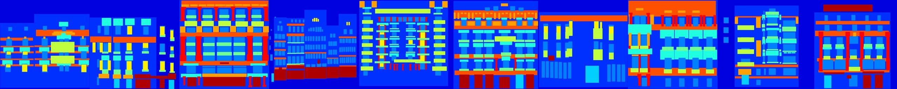
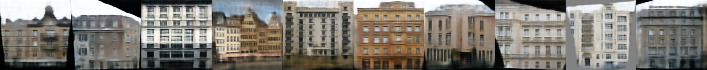
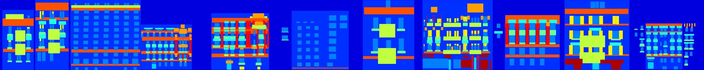
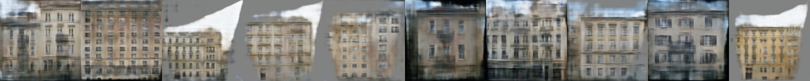

# pix2pix
[Image-to-Image Translation Using Conditional Adversarial Networks](https://arxiv.org/pdf/1611.07004v1.pdf) with tensorflow.
We here train with their Facade data.

# 10 epoch results

## from train data

## from test data

